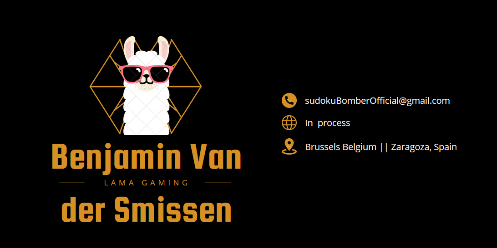

  

<h3 align="center">
Hi there, I'm Benjamin 👋
</h3>
<h2 align="center">
I'm a full-stack developer 💻, currently working on Android studio and web-development projects!
</h2>

  I love the entire process of developing creative applications,game apps and iot projects.

<h3 align="center"> 🤝 Connect with me: </h3>

<!--  to create a blog.-->
 
- 💬 If you have any question/feedback, please do not hesitate to reach out to me!

<h2 align="center"> 🔭 I'm currently working on </h2>

- Sudoku Bomber app (Android Studio)
- Crypto swap platform on web

<h2 align="center"> 🔭 projects in the pipeline </h2>

- Multiplayer trivia app (live online, Android Studio)
- IoT electronics embedded device project.
  Low Power, deep sleep, LPWAN, embedded devices, IoT, app, graphs.
  Creating my own hardware, using sensors to read out all life-signals of plants. give feedback as graphs on your mobile device via local wifi-module. Automatically water and control the ph value of the earth to have a healthy houseplant.
- Blog post about Sudoku App

<h2 align="center"> 🌱 I'm currently learning </h2>

- Android Studio
- javascript
- React / Redux
- MongoDB (certification?)

<h2 align="center"> 💼 Technical Skills </h2>

 

 

 

 

 

<h2 align="center"> 📝 Latest Blog Posts </h2>
<a href="https://medium.com/@benjaminvandersmissen/login-register-password-recovery-in-android-studio-java-98159f06273a">https://medium.com/@benjaminvandersmissen/login-register-password-recovery-in-android-studio-java-98159f06273a</a>
<h2 align="center"> 📈 GitHub Stats </h2>

<!--
**SonOfLuck/SonOfLuck** is a ✨ _special_ ✨ repository because its `README.md` (this file) appears on your GitHub profile.

Here are some ideas to get you started:

- 🔭 I’m currently working on ...
- 🌱 I’m currently learning ...
- 👯 I’m looking to collaborate on ...
- 🤔 I’m looking for help with ...
- 💬 Ask me about ...
- 📫 How to reach me: ...
- 😄 Pronouns: ...
- ⚡ Fun fact: ...
  -->
